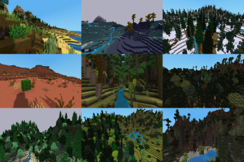

# unigame

[unigame](https://github.com/axcore/unigame) is a minimal base game for [Minetest](https://www.minetest.net/).

It is based on [minetest_game](https://github.com/minetest/minetest_game), but with all nodes, craftitems, crafts, biomes, decorations and ores removed, leaving behind only essential functionality (most API functions, player physics, a basic inventory mod, and so on).

The removed items can now be found in the [unilib mod](https://github.com/axcore/unilib), which is included. If you just want the minimal base game, then you can remove that mod. Otherwise, unigame is a fully-featured voxel experience, ready to play!

## Game details

Both unigame and unilib are in the ALPHA RELEASE stage. They are both fully playable, but future releases may introduce game-breaking changes. <u>Don't invest a lot of time and energy into your game</u> (unless you are willing to maintain the code yourself).

unilib is highly configurable. Please see the [README](/mods/unilib/README.md).

## Technical details

### minetest_game mods

Mods that have been copied from minetest-game, unaltered:

**bones**

**creative**

**env-sounds**

**game_commands**

**player_api**

**sethome**

**sfinv**

**spawn**

**weather**

Mods that have been copied from minetest-game, with minor changes (marked with **@@@**):

**dungeon_loot** - Loot from default (which is declared in this mod, and not in default itself0 has been removed. The corresponding items are declared as loot inside unilib itself. Loot from other minetest-game mods wewre declared in those mods; again, corresponding items are declared as loot inside unilib itself. Removed the dependence on default's chest, adding an optional dependence on unilib's ordinary chest.

**give_initial_stuff** - Removed the items from default, replacing them with the corresponding items from unilib. Removed the dependence of default, replacing it with an optional dependence on unilib

**mtg-craftguide** - Changed the "stereotypes" to the corresponding nodes/craftitems in unilib. No changes to mod.conf

Mods that have been copied from minetest-game, with all nodes, craftitems, crats, biomes etc removed (sometimes leaving a mod with no content at all) (changes not marked with **@@@):**

**beds**

**binoculars**

**boats**

**bucket**

**butterflies**

**carts**

**default**

**doors**

**dye**

**farming**

**fire**

**fireflies**

**flowers**

**map**

**screwdriver**

**stairs**

**tnt**

**vessels**

**walls**

**wool**

**xpanes**

### Original mods

[unilib](https://github.com/axcore/unilib)

### Other mods

The entire contents of these mods have already been imported into unilib. These modified versions of the original mods are almost empty, so that other mods that depend on them will run.

[basic_materials](https://content.minetest.net/packages/mt-mods/basic_materials/)

[moreores](https://github.com/minetest-mods/moreores)

